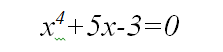
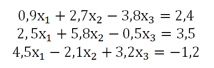
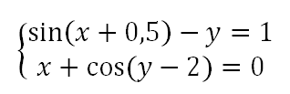
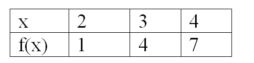
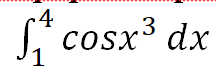
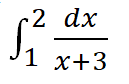
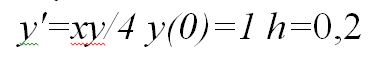

##java-math-app

<b>Eng</b> 
Описание на русском языке см. ниже. 
It is a university project in Russian. Not localized.
It is intended to be a bundle of applications for solving math problems using a single main GUI form.
Includes the following applications:
1. Solving non-linear equations (solve the equation by the methods of half division (bisections), chords, tangents (Newton's method) with an accuracy of 0.001);
2. System of linear algebraic equations (to solve SLAE by Gauss, iteration (successive approximation method), Seidel methods. For iteration and Seidel methods, solve with an accuracy of 0.001);
3. Solving a system of nonlinear equations. (solve the SNE using simple iteration and Newton methods with an accuracy of 0.001);
4. Interpolation of functions (approximation of functions). The function to be interpolated is given by the table
    a) Construct the Lagrange interpolation polynomial, find the value of the function at point 3.5.
    b) Construct Newton's interpolation polynomial from the first table.
5. Numerical integration. Numerical differentiation.
    a) Calculate the integral by the trapezoid method
    b) Calculate the integral by the Simpson formula for n = 8
    c) The function y = f (x) is given in Table. Using the method of numerical differentiation, find two derivatives of this function at the point x = 2.
6. Numerical solution of ordinary differential equations (ODE). Develop PS and solve the differential equation by methods: Runge-Kutta on the segment [0,2]
For equations and pictures see below the text in Russian.

<b>Rus</b> 
Это учебный проект для университема на русском языке. Не локализован.
Предполагается, что это пакет прикладных программ (ППП) для математических вычислений, использующих единую экранную GUI-форму.
Включает в себя следующие приложения:
1. Решение не линейных уравнений. Разработать ПС и решить уравнение методами половинного деления (бисекций),  хорд, касательных (метод Ньютона) с точностью до 0,001. Интервалы выбрать самостоятельно.

2. Система линейных  алгебраических уравнений (СЛАУ). Разработать ПС и решить СЛАУ методами Гаусса, итераций (метод последовательных приближений), Зейделя. Для методов итераций и Зейделя решить с точностью 0,001.

3. Решение системы нелинейных уравнений. Разработать ПС и решить СНУ методами простой итерации и Ньютона с точностью 0,001.

4. Интерполирование функций (приближение функций). Интерполируемая функция задана таблицей

а) Построить интерполяционный многочлен Лагранжа, найти значение функции в точке 3,5.
б) Построить интерполяционный многочлен Ньютона по первой таблице.

5. Численное интегрирование. Численное диференцирование.
а) Вычислить интеграл методом трапеций

б) Вычислить интеграл по формуле Симпсона при n=8

в) Функция y=f(x) задана табл.
Методом численного дифференцирования найти две производные этой функции в точке х=2.

6. Численное решение обыкновенных дифференциальных уравнений (ОДУ).
Разработать ПС и решить дифференциальное уравнение методами: Рунге-Кутта на отрезке  [0,2]

